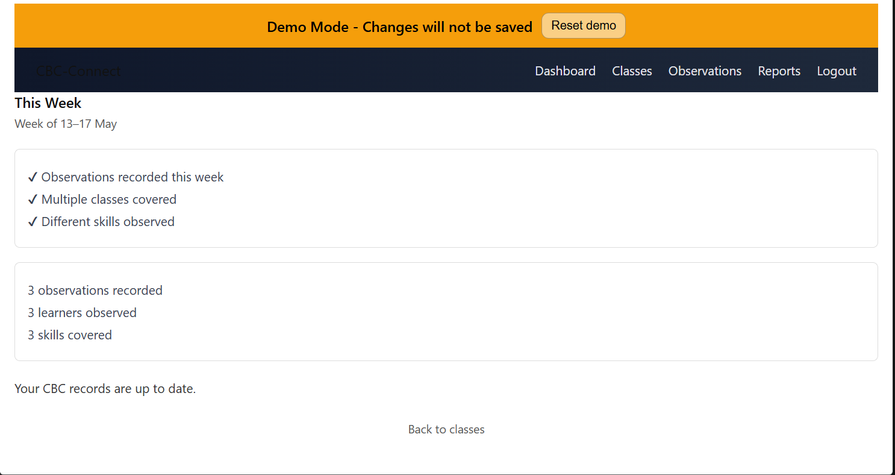
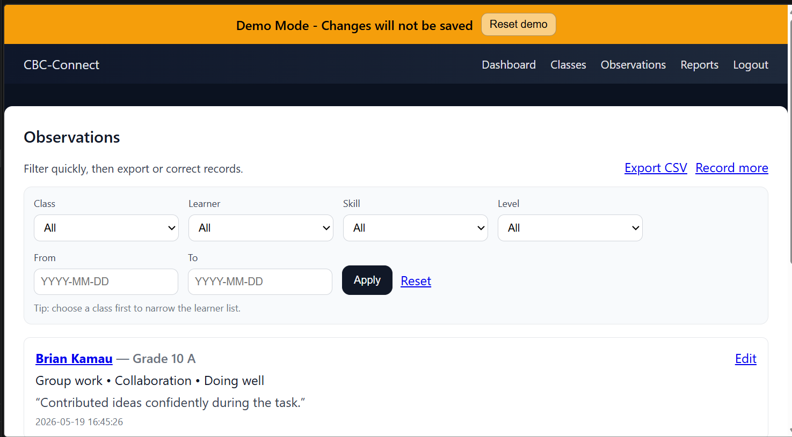
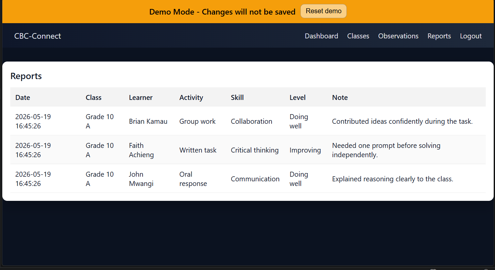
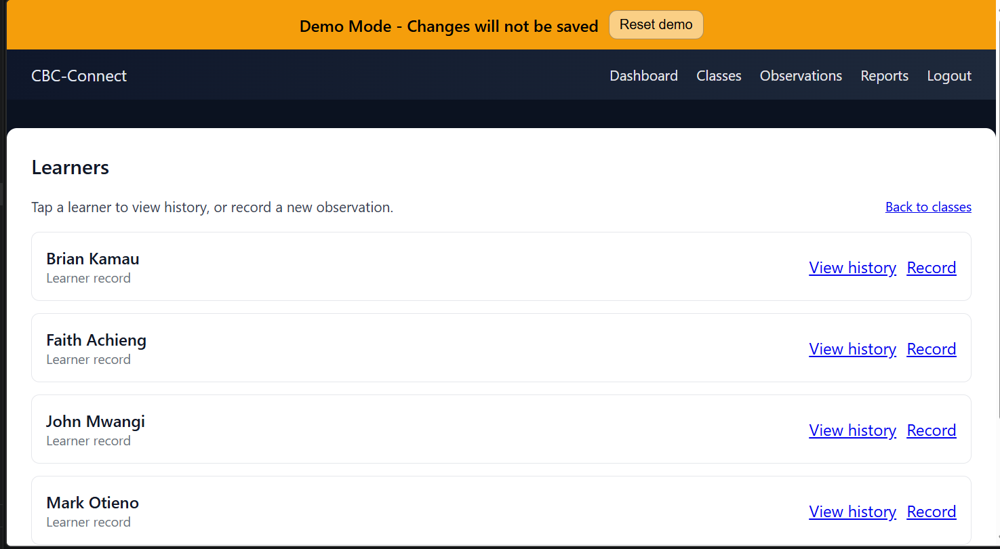

# CBC-Connect™ — Teacher Observation & Reporting System

CBC-Connect™ is a lightweight Teacher Observation & Reporting System designed for Competency-Based Curriculum (CBC) learning environments.

The platform enables teachers and school administrators to digitally record learner observations, track competency development, and generate structured educational reports through a clean operational interface.

Built for schools, educational institutions, and learning environments transitioning from manual reporting workflows to structured digital systems.

---

## 🚀 Overview

CBC-Connect™ simplifies learner observation management by replacing paper-based tracking processes with a centralized digital workflow.

The system allows educators to:

- Record learner observations
- Monitor competency development
- Track skill progression
- Generate structured reports
- Organize classroom activity records
- Improve educational operational visibility

This demo version is configured for safe public showcasing with demo-mode protections enabled.

---

## 🧠 Core Features

- Secure Teacher Login
- Learner Observation Recording
- Competency Tracking
- Weekly Summary Dashboard
- Reports & Observation Tables
- Class & Learner Navigation
- Educational Reporting Workflow
- Mobile-Friendly Interface
- Demo Protection Mode
- Operational School Dashboard

---

## 🛠️ Tech Stack

### Backend

- Python
- Flask

### Frontend

- HTML
- CSS
- JavaScript

### Database

- SQLite

---

## 📸 Screenshots

### Dashboard



### Observations



### Reports



### Learners



---

## ⚙️ Installation

### 1. Clone Repository

```bash
git clone https://github.com/kwetu-stack/cbc-connect.git
cd cbc-connect
2. Create Virtual Environment
Windows
python -m venv .venv
.venv\Scripts\activate
Mac/Linux
source .venv/bin/activate
3. Install Requirements
pip install -r requirements.txt
4. Configure Environment

Copy:

.env.example

to:

.env

Then update environment values if needed.

5. Run Application
python app.py
6. Access System
http://127.0.0.1:5000
💼 Educational Use Cases

CBC-Connect™ is suitable for:

Primary Schools
CBC Learning Institutions
Teacher Observation Programs
Learner Assessment Tracking
Educational Reporting Workflows
Classroom Operational Management
Skill Progress Monitoring
Student Development Tracking
🔒 Demo Mode

This public demo version is configured with safe demo protections.

Changes made through the live demo interface are not permanently saved.

📈 Roadmap
v1.1
Printable Learner Reports
Export to PDF
Observation Analytics
Attendance Integration
v2.0
Multi-School Support
Parent Portal
Teacher Role Management
Cloud Synchronization
v2.1
Full SaaS Deployment
Student Performance Analytics
AI-Assisted Learning Insights
Administrative Reporting Dashboard
👤 Author

Bundi Murithi
Founder & Software Engineer
Kwetu Partners Ltd

🌍 About Kwetu Partners

Kwetu Partners builds operational business systems focused on:

Inventory Management
Logistics & Dispatch
Visitor & Reception Management
Construction Management
Education Technology
Identity & Access Systems

Kwetu follows a Monozukuri-inspired engineering philosophy centered on craftsmanship, operational clarity, and long-term system reliability.

Website:

https://kwetupartners.net/

📄 License

MIT License — Free to use, modify, and distribute.

🌐 Built in Kenya

Designed and engineered by Kwetu Partners Ltd.

Focused on solving practical operational challenges across emerging markets.